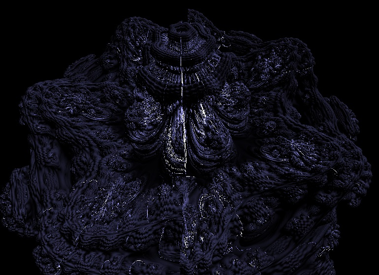
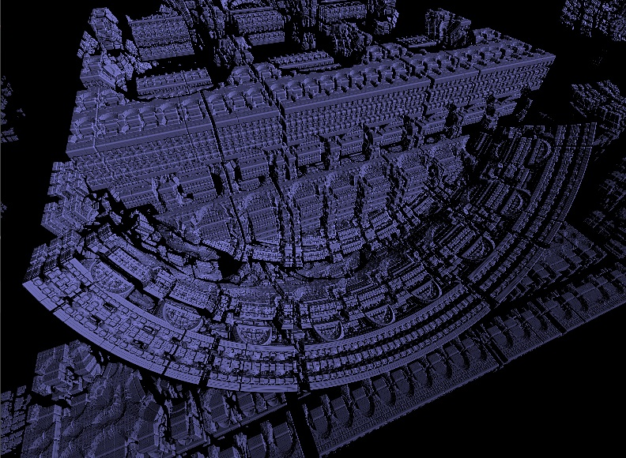

# GLSL Raymarcher

This is a raymarching engine using the OpenGL and the Rust Glutin library used for rendering shapes defined in terms of a distance estimator.

Raymarching is a technique that is similar to ray tracing, but where the rays are stepped by the amount of the minimum distance to the scene until the distance is small enough, instead of calculating the exact intersection location.

## Features
- [x] Raymarching
- [x] Spaceship Controls
- [x] Infinite Zoom
- [ ] Scene configuration GUI

